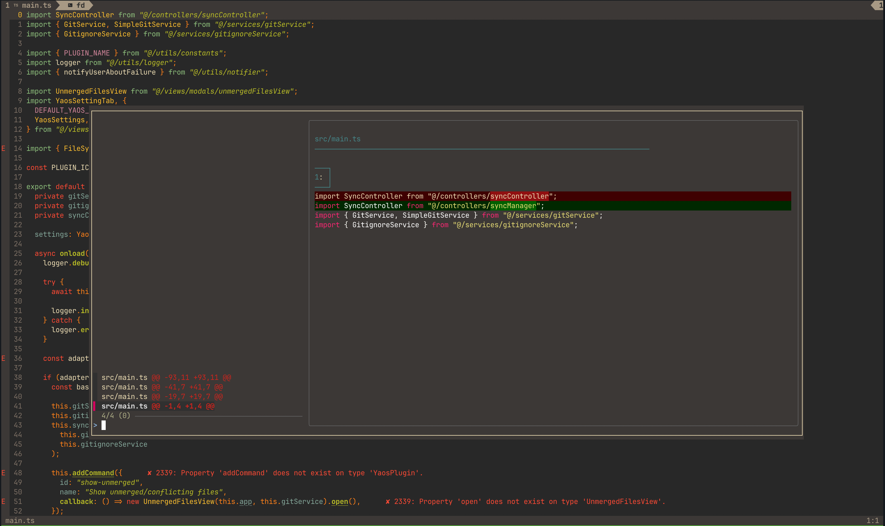

# search-and-replace.nvim

A Neovim plugin for fast, interactive, project-wide search and replace using [fd](https://github.com/sharkdp/fd) and [sad](https://github.com/ms-jpq/sad). Provides a floating terminal UI, glob filtering, and visual-mode integration for easy code refactoring.



## Features

- Interactive search and replace using [sad](https://github.com/ms-jpq/sad) in a floating terminal
- Uses [fd](https://github.com/sharkdp/fd) for fast, flexible file finding
- Supports glob patterns (e.g. `*.lua`, `src/*.js`) to filter files
- Always excludes `.git` directories from replacements
- Visual mode integration: use your selection as the search term
- Simple, dependency-light, and Neovim-native

## Requirements

- Neovim 0.7.0 or later (for floating window and Lua API support)
- [fd](https://github.com/sharkdp/fd) installed and in your `$PATH`
- [sad](https://github.com/ms-jpq/sad) installed and in your `$PATH`

## Installation

Install using your preferred Neovim package manager.

### Using [packer.nvim](https://github.com/wbthomason/packer.nvim)

```lua
use "mahyarmirrashed/search-and-replace.nvim"
```

### Using [vim-plug](https://github.com/junegunn/vim-plug)

```vim
Plug "mahyarmirrashed/search-and-replace.nvim"
```

### Using [lazy.nvim](https://github.com/folke/lazy.nvim)

```lua
{
  "mahyarmirrashed/search-and-replace.nvim",
  config = function()
    require("search-and-replace").setup()
  end,
}
```

## Usage

The plugin provides two main commands:

- `:SearchAndReplace <search> <replace> [glob]`
  Search and replace across your project. Optionally filter files with a glob pattern.
- `:'<,'>SearchAndReplaceVisual <replace> [glob]`
  Use your visual selection as the search term, and replace across matching files.

### Example Commands

- Replace `foo` with `bar` in all files:

```
:SearchAndReplace foo bar
```

- Replace `foo` with `bar` only in `.lua` files:

```
:SearchAndReplace foo bar *.lua
```

- Visually select text, then replace it with `replacement` in all files:

```
:'<,'>SearchAndReplaceVisual replacement
```

- Visually select text, then replace it with `replacement` only in `.js` files:

```
:'<,'>SearchAndReplaceVisual replacement *.js
```

### Function Documentation

#### `setup()`

Registers the user commands. Call this in your Neovim config:

```lua
require("search-and-replace").setup()
```

#### `:SearchAndReplace <search> <replace> [glob]`

- **search**: The pattern to search for (regex supported).
- **replace**: The replacement string.
- **glob** (optional): Glob pattern for files (e.g. `*.lua`, `src/*.js`). Defaults to all files.

#### `:'<,'>SearchAndReplaceVisual <replace> [glob]`

- Uses your last visual selection as the search pattern.
- **replace**: The replacement string.
- **glob** (optional): Glob pattern for files.

### Visual Mode Integration

1. Select text in visual mode (`v`, `V`, or `Ctrl-v`).
2. Type `:SearchAndReplaceVisual replacement [glob]`.

The selected text becomes the search pattern.

## Credits

- [sad](https://github.com/ms-jpq/sad) for the interactive CLI UI.
- [fd](https://github.com/sharkdp/fd) for blazing-fast file finding.
- Inspired by the Neovim plugin community.

## License

[MIT License](./LICENSE)
